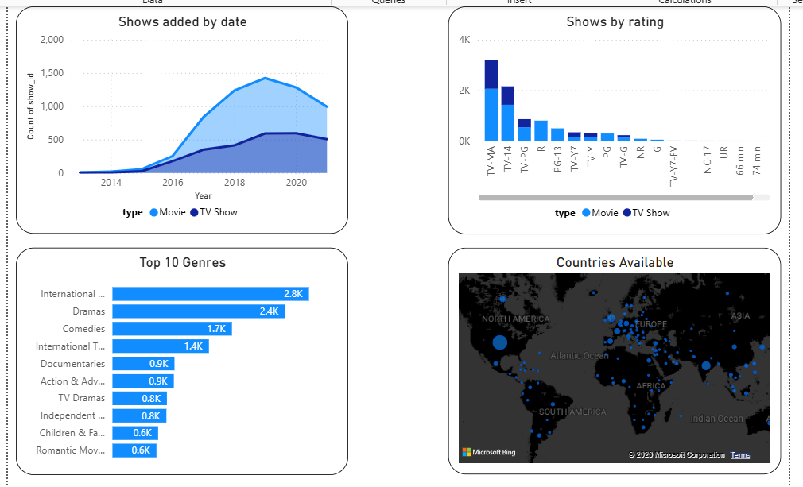

<<<<<<< HEAD
# Netflix Titles Data Analysis

## Project Overview
This repository contains a Netflix titles dataset and supporting files used for exploratory data analysis and visualization. The goal of this project is to demonstrate data analyst skills by cleaning, exploring, and deriving actionable insights from entertainment streaming data.

## Contents
- `netflix_titles.csv` — main dataset with show metadata including title, type, release year, rating, and duration.
- `cast.csv` — cast member columns for each show.
- `Country.csv` — country/region information for each show.
- `Description.csv` — show descriptions.
- `Director.csv` — director information for each show.
- `Listed_in.csv` — genre/category labels for each show.
- `first project.pbix` — Power BI report file for data visualization and dashboards.
- `netflix_titles.xlsx` — Excel version of the Netflix dataset for quick review or analysis.

## Project Goals
- Explore the Netflix catalog by title type (Movie vs TV Show)
- Analyze release year and date distribution
- Identify prominent directors, cast members, and countries represented
- Examine genre/category trends using the `listed_in` categories
- Create dashboards and visual summaries to communicate findings clearly

## Analysis Approach
1. Import the dataset into a data analysis tool such as Python, Excel, or Power BI.
2. Clean and merge related data files using `show_id` as the key.
3. Normalize fields like duration and categories for consistent analysis.
4. Generate metrics such as counts by type, year, rating, country, and genre.
5. Build visualizations to highlight the most frequent genres, top release years, and geographic distribution.

## Key Skills Demonstrated
- Data cleaning and transformation
- Exploratory data analysis (EDA)
- Data visualization and storytelling
- Working with structured CSV/Excel datasets
- Using Power BI for interactive reporting

## How to Use This Repository
1. Open `netflix_titles.xlsx` or import `netflix_titles.csv` into your preferred analytics tool.
2. If using Power BI, open `first project.pbix` to view the existing dashboards and visualizations.
3. For deeper analysis, join the supporting files (`cast.csv`, `Country.csv`, `Director.csv`, `Listed_in.csv`, `Description.csv`) with `show_id`.
4. Explore patterns by filtering on `type`, `release_year`, `rating`, and category labels.

## Dashboard Architecture
The Power BI report is divided into two specialized analytical views: an executive **Overview Page** for high-level macro trends, and a granular **Single View Page** for deep-dive title asset analysis.

### 1. Macro Overview View
As captured in `img/Overview.png`, this view provides a comprehensive breakdown of the content catalog distribution across time, content type, global reach, and compliance metrics.

- **Temporal Volume Tracking ("Shows added by date"):** An area trend chart evaluating catalog expansion over time, split dynamically by content medium (Movies vs. TV Shows).
- **Content Compliance & Demographics ("Shows by rating"):** A stacked column chart visualizing the catalog's target audiences, emphasizing prominent segments like `TV-MA` and `TV-14`.
- **Genre Concentration ("Top 10 Genres"):** A horizontal ranking metric pinpointing inventory density across major clusters like International, Dramas, and Comedies.
- **Geographic Coverage ("Countries Available"):** A global map distribution visualization mapping regional availability trends across international territories.

### 2. Granular Single View Page
As captured in `img/Single page view.png`, this layout acts as a dynamic title passport, isolating data points down to an individual title selection via an interactive search matrix.

- **Key Performance Indicators (KPI Cards):** Instantaneous extraction of isolated variables including normalized **Release Year** and global **Rating** structures.
- **Logistical Catalog Metadata:** Dedicated descriptive containers displaying full plot synopses, category classifications, directorial credits, and key ensemble cast members.
- **Isolated Spatial Targeting ("Countries Available"):** A reactive map chart that highlights exactly which geographic territories possess streaming access to the selected title.

## Dashboard Images
Screenshots are stored in the `img/` folder and rendered below for GitHub preview.

### Overview Page

This view highlights the catalog-wide story with:
- a temporal trend of shows added over time,
- rating segmentation for audience compliance,
- the top genre clusters by title volume,
- and global availability mapping.

### Single View Page

This view focuses on an individual title with:
- KPI cards for release year and rating,
- detailed metadata including synopsis, genres, directors, and cast,
- and the reactive `Country Released` map for country-level release coverage.

## Suggested Insights to Highlight
- Distribution of movies vs TV shows over time
- Top countries producing Netflix content
- Most common genres/categories among titles
- Trends in ratings and duration for movies vs TV shows
- Influence of directors and cast on content output

## Future Enhancements
- Add Python or SQL scripts for reproducible data processing
- Clean and consolidate cast/country/director columns into long-form tables
- Build time-series analysis for content additions by year and month
- Create automated dashboards or a Jupyter notebook walkthrough

=======
# Data-Analysis-on-Netflix-Dataset
>>>>>>> 57f292791011bd37b0cc9408c45d2777e533b344
